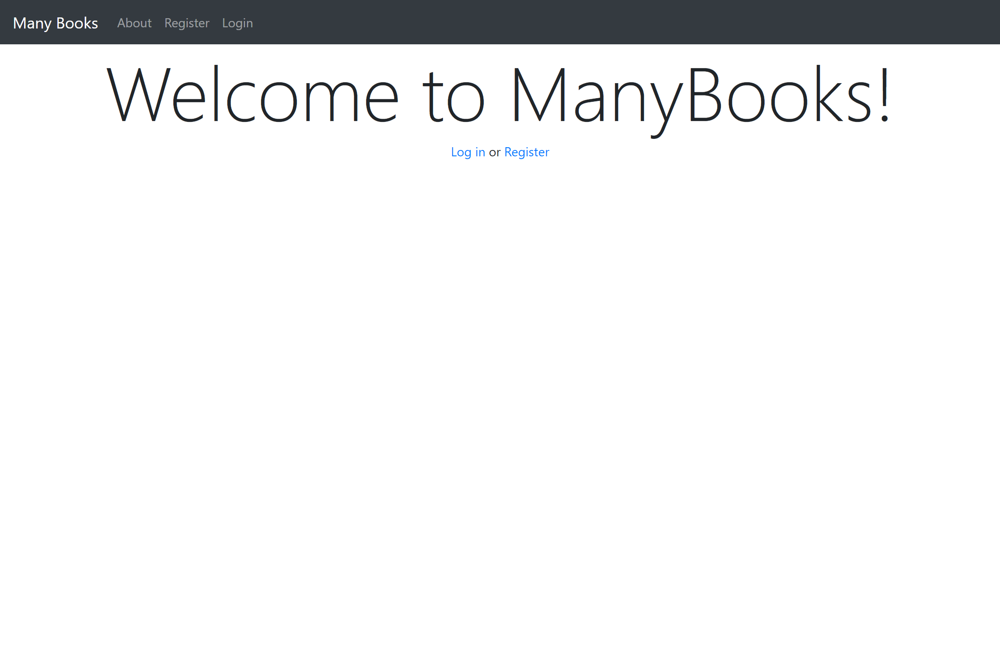
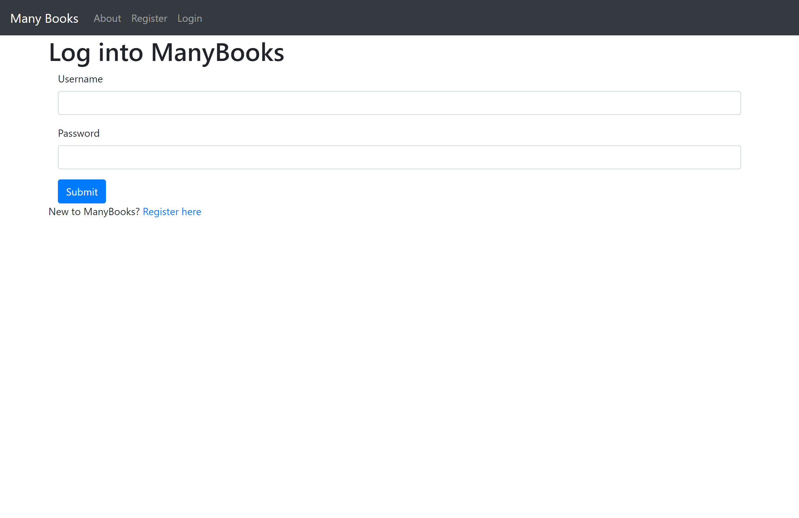
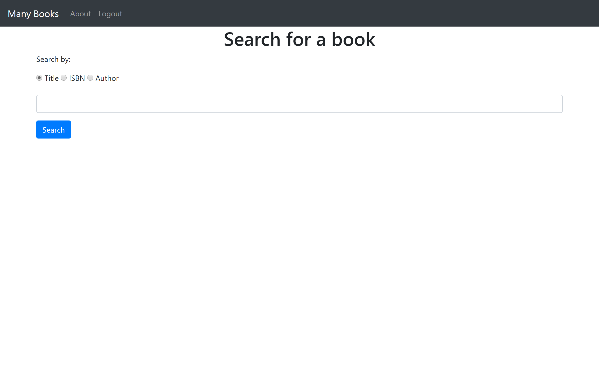
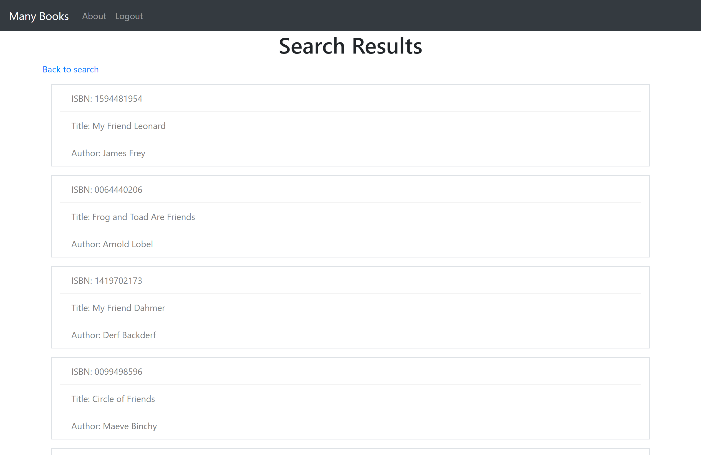
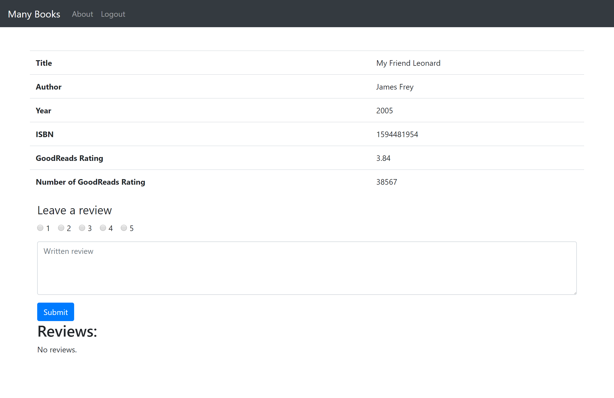

# Project 1

This is a simple web site that I built as part of a project for the online MOOC CS50 Web development in Python and Javascript.  

This site allows you to leave reviews on books that are in the ManyBooks database.  You can also see reviews that others users of ManyBooks have left.  ManyBooks also pull review information from GoodReads using their API.  Here are some screenshots:

### Landing Page:

### Login Page:

### Search For a book:

### Search results for 'friend':

### Book details and review page:

